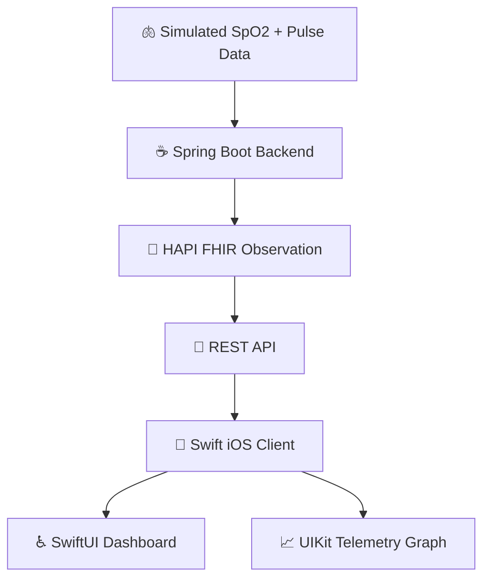

# Respiro

Respiro is an accessible iOS app that turns standardized FHIR pulmonary data into a simple, real-time oxygen and pulse monitoring experience.

### Why

Home pulse oximeter data is often trapped inside consumer apps, while healthcare systems rely on standards like HL7 FHIR.

Respiro focuses on one small problem: making SpO2 and pulse data easy to view on iPhone while keeping the underlying data in a healthcare-standard format.

The goal of Respiro to make pulmonary telemetry more accessible, interoperable, and easier to understand.

## System architecture

### Tech stack

- Swift
  - SwiftUI for the app interface
  - UIKit for the specialized, real-time graph
- Java, Spring Boot, REST APIs  
- HL7 FHIR, HAPI FHIR  
- JUnit, XCTest  
- Docker, Amazon ECR, Amazon ECS, AWS IAM  
- Git, GitHub, GitHub Actions

### Diagram

