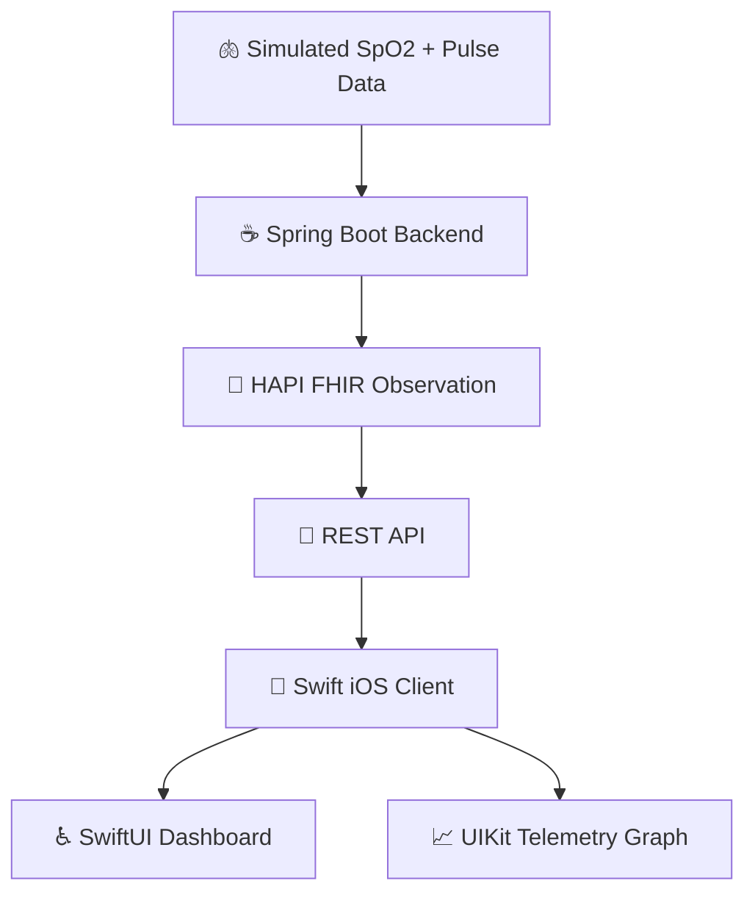

# Respiro

Respiro is an accessible iOS app that turns standardized FHIR pulmonary data into a simple, real-time oxygen and pulse monitoring experience.

### Why

Home pulse oximeter data is often trapped inside consumer apps, while healthcare systems rely on standards like HL7 FHIR.

Respiro focuses on one small problem: making SpO2 and pulse data easy to view on iPhone while keeping the underlying data in a healthcare-standard format.

The goal of Respiro to make pulmonary telemetry more accessible, interoperable, and easier to understand.

## System architecture

### Tech stack

- Swift
  - SwiftUI for the app interface
  - UIKit for the specialized, real-time graph
- Java, Spring Boot, REST APIs  
- HL7 FHIR, HAPI FHIR  
- JUnit, XCTest  
- Docker, Amazon ECR, Amazon ECS, AWS IAM  
- Git, GitHub, GitHub Actions

### Diagram



## Getting started

### Backend

```
cd backend
mvn spring-boot:run
```

Starts on `http://localhost:8080` and begins generating a simulated reading every 3 seconds.

- `GET /api/vitals/latest` — most recent reading, as a FHIR `Bundle` of `Observation`s
- `GET /api/vitals/history?limit=50` — recent readings (1–50), same shape
- `GET /api/vitals/stream` — Server-Sent Events stream of new readings as they're generated
- `GET /actuator/health` — health check

Run the tests with `mvn test`, or build the container with `docker build -t respiro-backend backend`.

### iOS client

The Swift source lives in `ios/Respiro/` and its tests in `ios/RespiroTests/`. Building the app requires Xcode on macOS:

1. Create a new iOS App project in Xcode (SwiftUI interface).
2. Add the files under `ios/Respiro/` to the project, and `ios/RespiroTests/` as a unit test target.
3. If running on a physical device, update `RespiroApp.backendURL` to your Mac's LAN address — `localhost` on a device refers to the device itself.
4. Run the backend first, then build and run the app.
